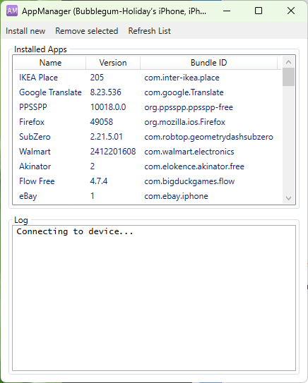

# AppManager
GUI for ideviceinstaller for Windows  
This program does NOT sideload applications used for jailbreaking devices (Phoenix, h3lix, Unc0ver, Electra)

## Requirements  
iOS Device (iOS 2 and up should work)  
AppSync (if installing unsigned/cracked apps)  
Windows 7 or newer   
.NET Framework 4.5 or newer  
iTunes 10 or newer (NOT from Microsoft store, ensure Apple Devices is not installed)  

If you find this tool useful, please consider donating to us on Ko-Fi
https://ko-fi.com/kawaiizenbo

